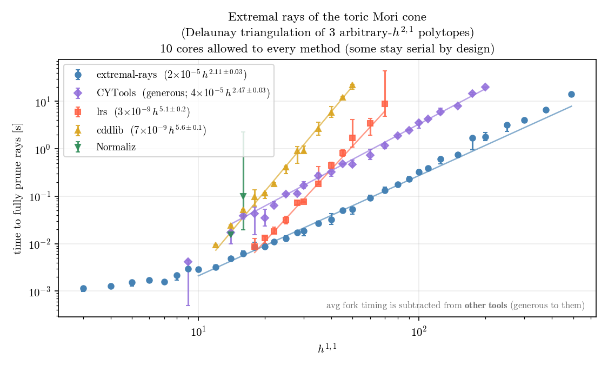
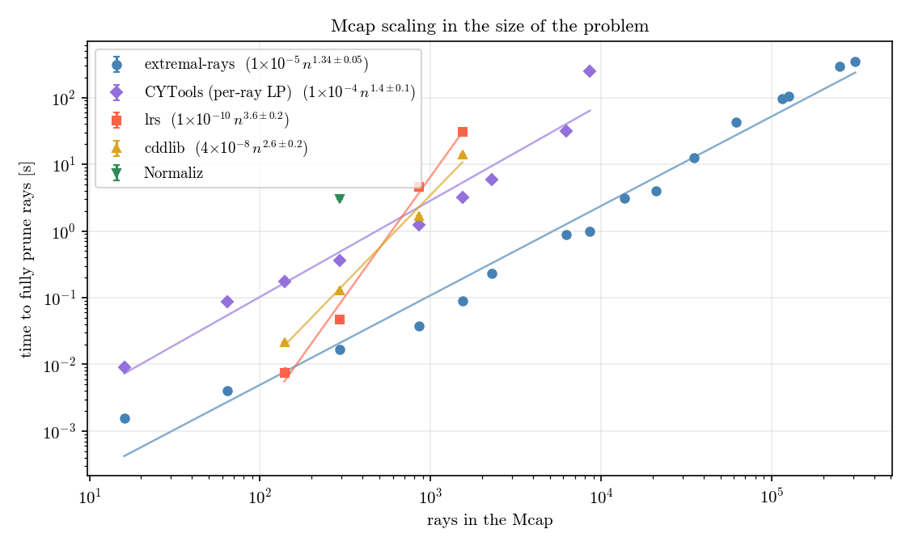

# extremalrays
*[Nate MacFadden](https://github.com/natemacfadden), Liam McAllister Group, Cornell*

Fast extremal rays of pointed polyhedral cones via [Clarkson's output-sensitive algorithm](https://doi.org/10.1109/SFCS.1994.365723). An alternative to the per-ray feasibility LP; should be quicker on hard cases.

## Description

Given $R\in\mathbb{Z}^{n\times d}$ (or floats) whose rows $r_i$ generate a pointed cone

$$ \mathcal{C} = \\{\textstyle\sum_i \lambda_i r_i : \lambda_i \geq 0\\}, $$

`exhaustive` returns the indices of the unique minimal generating subset, i.e. the extremal rays. `sample` is a cheaper cousin that certifies a subset of them and makes no completeness claim. `verify` audits an answer from explicit certificates, checking each one rather than trusting a solver status code.

The usual approach (CYTools' per-ray LP backend, its default through v1.4.12, and `redund` in cddlib or lrs) asks, for each ray, whether it is a non-negative combination of the other $n-1$. Redundant rays answer quickly. Extremal ones need an infeasibility proof for a big degenerate system, and that is where the time goes. `extremalrays` never asks that question: a candidate is only ever tested against the small set of rays already confirmed extremal.

One caveat on `verify`. Its certificates are built independently of `exhaustive` (different formulation, opposite LP direction, exact arithmetic when the rays are integral), but the two share this package's preprocessing. A bug in the deduplication would be invisible to it.

### Prior art

Removing redundant generators is a classical problem with good tools: the double description method of Motzkin et al., as implemented in Fukuda's [cddlib](https://people.inf.ethz.ch/fukuda/cdd_home/); reverse search in Avis's [lrslib](http://cgm.cs.mcgill.ca/~avis/C/lrs.html); plus [Normaliz](https://www.normaliz.uni-osnabrueck.de/) and [polymake](https://polymake.org/). See [benchmarks](#benchmarks) for how we compare. Our benchmarks are focused on our cases of interest (cones arising in CYTools/string theory).

## Limitations

- The cone must be pointed (strongly convex); non-pointed input raises `ValueError`. Decompose into lineality space + pointed quotient first (as CYTools already does).
- Parallel sweeps (`n_workers`) only pay off on long jobs: worker startup and snapshot refreshes cost a few seconds, so at benchmark scale `n_workers=8` is marginally *slower* in wall time AND costs roughly 2x the CPU-seconds; on a 10M-candidate job it gave ~1.9x. Workers are spawned, so a script passing `n_workers > 0` must guard its entry point with `if __name__ == "__main__":`; without it, `exhaustive` detects the nested call and falls back to a serial sweep with a warning rather than recursing.
- Sparse (CSR) input is for *feasibility at scale*, not for speed: it is what makes a 10M-ray cone possible at all (dense would be tens of GB), but at benchmark scale it saves no time and costs ~1.8x peak RSS.
- Tolerance is not a free parameter on badly conditioned input: see the note on missing rays in [Algorithm Notes](#algorithm-notes). Integer rays get exact escalation; float rays only get a warning.

## Installation

```
pip install extremalrays                 # runtime only
pip install "extremalrays[exact]"        # + python-flint, faster exact arithmetic
```

From a checkout, swap `extremalrays` for `-e .`:

```
pip install -e ".[test]"                 # + pytest, to run the suite
```

Dependencies: numpy, scipy, highspy, with version floors that CI installs and tests. `python-flint` is optional; without it a pure-Python fallback is used.

## Usage

```python
import numpy as np
from extremalrays import exhaustive, sample, verify

# four rays in the plane; only the outer two generate the cone
R = np.array([[1, 0], [2, 1], [1, 1], [0, 1]])

idx = exhaustive(R)              # -> array([0, 3]), indices into R
ext = R[idx]                     # -> [[1, 0], [0, 1]]

ok, report = verify(R, idx)      # -> True, with the certificates checked

some, curve = sample(R, work=200)   # cheap certified subset (no completeness)
```

Rays can also arrive from a file or another library rather than a literal, and any `(n, d)` array-like works: `exhaustive(np.load("rays.npy"))`, or a `scipy.sparse` CSR matrix, which is kept sparse end to end.

Integer input enables exact primitive-vector deduplication and an exact rational fallback in cleanup. Duplicate directions collapse to their first occurrence. A wall-time breakdown of the last call is stored in `extremalrays.core.LAST_PROFILE`.

For long jobs, `n_workers=8` sweeps candidates in parallel against frozen snapshots of the confirmed set (verdicts stay exact; rare separation failures are re-resolved serially), and `checkpoint="state.npz"` saves state atomically every minute. Rerunning the same call resumes from the last checkpoint, guarded by a fingerprint of the input rays.

Candidate *order* matters for speed. The separation oracle warm-starts between consecutive LPs, so an order that keeps similar rays adjacent runs faster. On the benchmark cone, generation order takes 13.8 s and a shuffle of it takes 21 to 25 s. Structured order is the common case, so it is the default; for unstructured input, `sort_candidates=True` lexsorts internally and gets the shuffle back to 13.7 s.

## Algorithm Notes

The first step is to convert the problem of computing extremal rays of $\mathcal{C}$ into a polytope-problem. This requires that $\mathcal{C}$ is pointed (no linear subspaces) so that we can scale the rays all to some affine hyperplane $w\cdot x=1$. We can easily find $w$ using LP,

$$ \text{find } w\in\mathbb{R}^d \quad \text{s.t.} \quad w\cdot r_i \geq 1 \ \ \forall i, $$

for $r_1,\dots,r_n\in\mathbb{R}^d$ the (potentially-non-extremal) rays. This LP is solvable if and only if $\mathcal{C}$ is pointed. Further, the rescaling $r_i\leftarrow r_i/(w\cdot r_i)$ forces all rays to land on the slice $w\cdot x=1$ and hence be interpretable as a polytope $\mathrm{conv}\\{r_1,\dots,r_n\\}$.

Let $E$ be the rays confirmed extremal so far, which starts empty and only grows. A candidate $p$ is tested against it by searching for a linear functional $c\in\mathbb{R}^d$ that separates $p$ from $\mathrm{cone}(E)$:

$$ \max_{c\in\mathbb{R}^d}\ c\cdot p \quad \text{s.t.} \quad c\cdot e \leq 0\ \ \forall e\in E, \quad -1\leq c_i\leq 1, $$

always feasible ($c=0$) and bounded (the box on $c_i$). Value $0$ means $p\in\mathrm{cone}(E)$ by Farkas, so $p$ is redundant regardless of how incomplete $E$ still is. A positive value says nothing about $p$ itself; it just says $E$ is missing an extremal ray. The optimizer $c$ then points at one: the tie-broken maximizer of $c\cdot r_i$ over the remaining candidates is provably a vertex, joins $E$, and $p$ gets retested. That bounds the LP count by $n+|E|$, all of them small, on one persistent warm-started HiGHS model.

This computation is generally floating point, so noise and tolerances need to be considered. Explicitly, a ray $r_i$ is said to be redundant when $c\cdot r_i<\texttt{tol}$. On badly conditioned cones, this can fire even for $r_i$ extremal. To guard against this,
  1) values $10^{-12}<c\cdot r_i<\texttt{tol}$ are re-checked in exact rational arithmetic when the rays are integral ($10^{-12}$ is a deliberately low noise floor; re-checking a genuinely redundant ray only costs time), and
  2) `verify` audits the finished answer with the opposite LP, demanding an explicit $\lambda\geq0$ with $E^{\mathsf T}\lambda=r_i$ rather than inferring redundancy from a separation value near $0$. Borderline cases go to the same exact arithmetic, promoting discarded rays to extremal or demoting kept ones to redundant.

By using rational arithmetic, floating point errors are avoided and definitive results can be achieved for integral rays.

## Benchmarks

Compared against CYTools, lrs, cddlib and Normaliz on cone families built from the Kreuzer-Skarke polytopes, on an Apple M1 Pro (32 GB RAM, macOS 26). Each method gets all 10 cores, though several stay serial by design. Every method's answer is checked against this package's before it is timed, so a fast wrong answer cannot win, and the fork cost of the command-line tools is measured and subtracted. Points are medians over three polytopes per $h^{1,1}$; error bars are the spread between them. Recreate with the [`benchmarks/`](benchmarks) scripts.

**Torically inherited Mori cone**, $h^{1,1} = 3$ to $491$:

<p align="center">
  
</p>

**Mcap**, the intersection of the torically inherited Mori cones from all '2-face equivalent' CYs. Being an intersection it is a *smaller* cone than any of them, but a much bigger problem: 20,899 generators at $h^{1,1}=50$ against 333. Here the x-axis is generator count rather than $h^{1,1}$. The two are not monotonically related (126,363 generators at $h^{1,1}=90$ against 115,678 at $h^{1,1}=100$), so only the former orders these problems by size:

<p align="center">
  
</p>

Against CYTools the exponents agree and the gap is a constant of roughly an order of magnitude. Against cddlib and lrs it is the exponent that differs ($n^{2.6}$ and $n^{3.6}$ against $n^{1.34}$), which is why they stop around 1,500 rays.

On the $h^{1,1}=491$ torically inherited Mori cone itself (3509 rays in 491 dimensions, 884 extremal):

| method | time |
| --- | --- |
| this package | **~13 s** |
| CYTools v1.4.12 `extremal_rays` | does not finish |
| full certificate audit (optional) | ~11 s on 8 workers |

The largest run so far is the Mcap of that same CY: 10,026,843 rays in 491 dimensions, 1,218 extremal, in 79.6 min with `n_workers=8` and the slice functional handed in via `w=`.

## Citation

If you use `extremalrays` in your research, please cite it:

```bibtex
@software{extremalrays,
  author  = {MacFadden, Nate},
  title   = {extremalrays},
  url     = {https://github.com/LiamMcAllisterGroup/extremalrays},
  orcid   = {0000-0002-8481-3724},
}
```

## Organization

```
extremalrays/
├── src/extremalrays/
│   ├── core.py                     # exhaustive(): Clarkson sweep, separation + membership oracles, cleanup, checkpoints, workers
│   ├── inner.py                    # sample(): cheap certified subset via dual-cone facet walks
│   └── verify.py                   # verify(): independent certificate audit, parallelisable
├── tests/
│   ├── conftest.py                 # shared helpers: random pointed cones, vendored CYTools per-ray LP reference
│   ├── test_exhaustive.py          # known cones, degenerate input, invariances, brute-force cross-checks
│   ├── test_parallel_checkpoint.py # n_workers sweeps, checkpoint save/resume/fingerprint
│   ├── test_sample.py              # certified-subset property, determinism, options
│   ├── test_verify.py              # accepts right answers, rejects wrong ones, parallel audit
│   ├── test_internals.py           # unit tests of the oracles, dedup, exact arithmetic
│   ├── test_readme_examples.py     # the README snippet runs as documented
│   └── data/                       # Mcaps with CYTools-produced extremal sets (regression fixtures)
├── benchmarks/                     # perf benchmarks; double as usage examples + make the README figures
│   ├── benchmark_h11_491.py        # the flagship cone: repeats, dispersion, machine capture, opt-in classical baseline
│   ├── benchmark_mori_cone.py      # runtime vs h11 against CYTools, lrs, cddlib, Normaliz
│   ├── benchmark_mcap.py           # the same against the Mcap, vs h11 and vs problem size
│   ├── benchmark_parallel.py       # where parallelism pays: the sweep vs the audit
│   ├── make_cones.py               # build the Mori cone family from the Kreuzer-Skarke polytopes
│   ├── make_caps.py                # build the Mcap family (needs the mcap tooling)
│   ├── _bench.py                   # shared timing helper: warmup, repeats, median with spread
│   ├── _plot.py                    # the runtime-vs-h11 figure, with fitted power laws
│   ├── _plot_scaling.py            # the runtime-vs-ray-count figure
│   ├── _cytools_driver.py          # runs CYTools in a fresh interpreter so it can be time-limited
│   └── data/                       # cone and cap ray matrices (polytope tables are fetched on demand)
├── docs/                           # README figures (benchmark_*.png)
├── CHANGELOG.md
└── pyproject.toml
```

### Reproducing the figures

```
python benchmarks/make_cones.py --per-h11 3 --h11 3 5 10 20 50 100 200 491
python benchmarks/benchmark_mori_cone.py            # -> docs/benchmark_prior_art.png
python benchmarks/make_caps.py --h11 10 20 30 40 50
python benchmarks/benchmark_mcap.py                 # -> docs/benchmark_cap*.png
```

Comparisons are skipped for tools that are not installed, and every method's answer is checked against this package's before it is timed. Add `--plot-only` to redraw a figure from results already measured.

## License

GPL-3.0-or-later (matching [CYTools](https://github.com/LiamMcAllisterGroup/cytools)).
